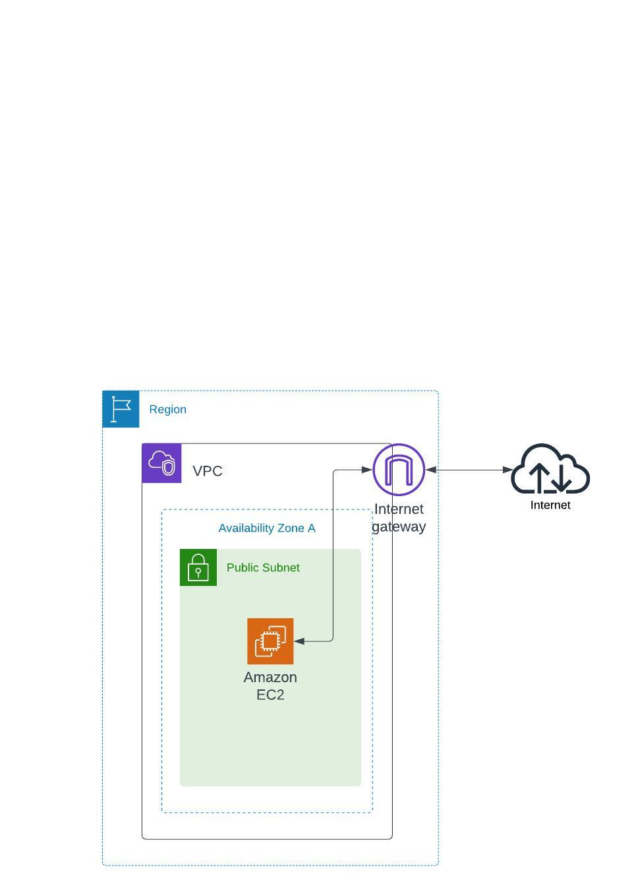

# Goal 
- Creating an EC2 instance that allow user access through the Internet
- Allowing admin access via SSH to the EC2 and install the web server

# Learning Objective
- Understand the AWS services/components including
  - VPC
  - Internet Gateway
  - Subnet
  - Security Group
- How to configure Routing and ACL 
- How to assign an elastic IP to the network interface 
- How to spawn an EC2 instance 

