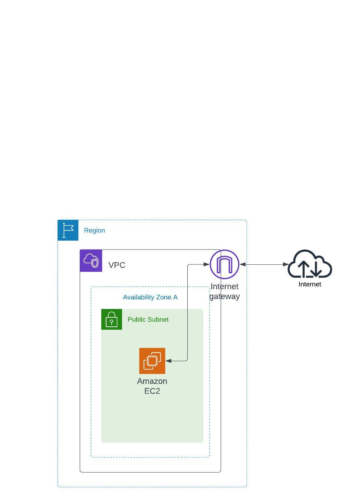

# Goal 
- Same goal as pratice-001 but building it with modules
- Creating an EC2 instance that allow user access through the Internet
- Allowing admin access via SSH to the EC2 and install the web server

# Learning Objective
- Understand how to use modules in terraform
  - how to use variable
  - how to use outputs
- define a scope for modulize a webserver build
- grouping resources by different .tf files

